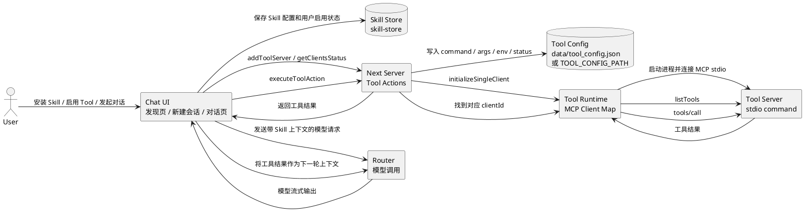
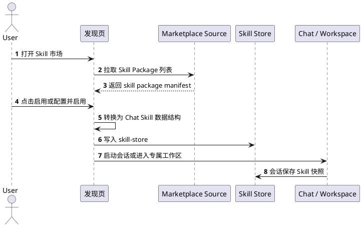
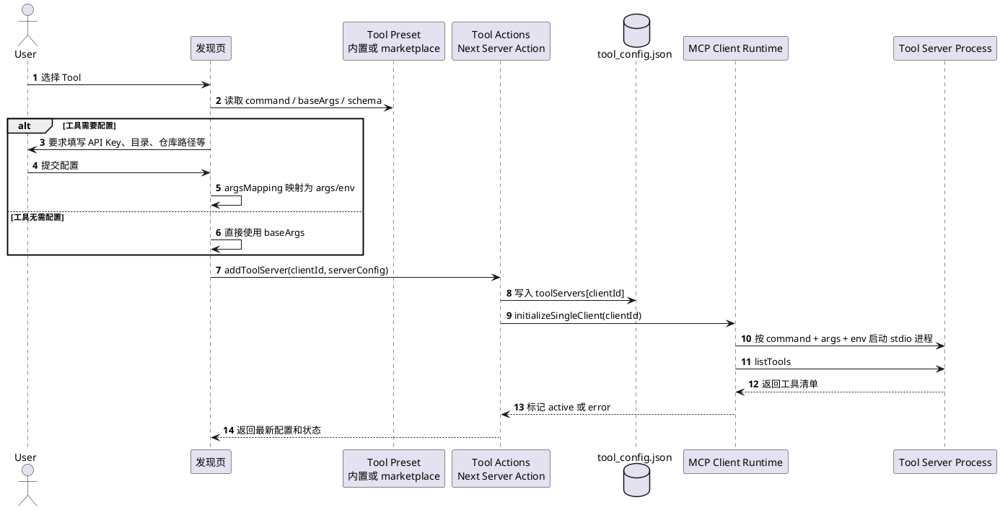
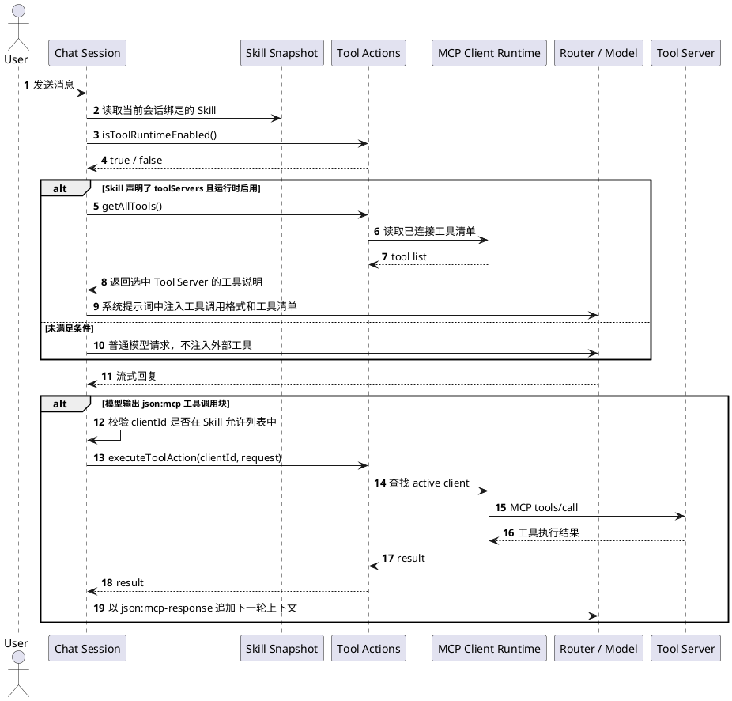
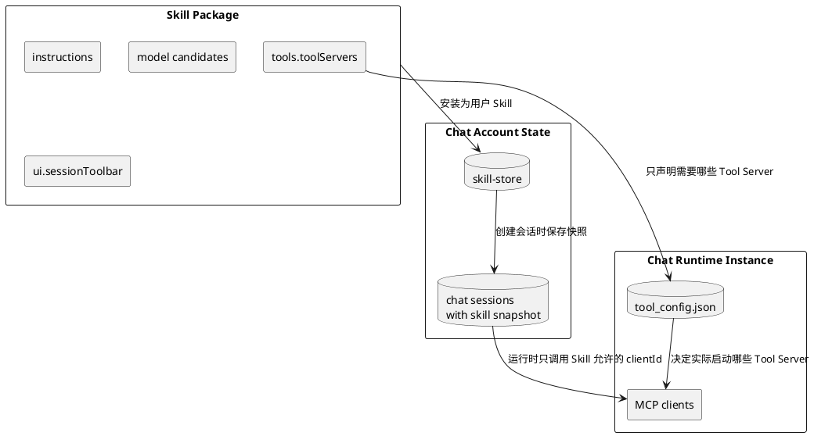
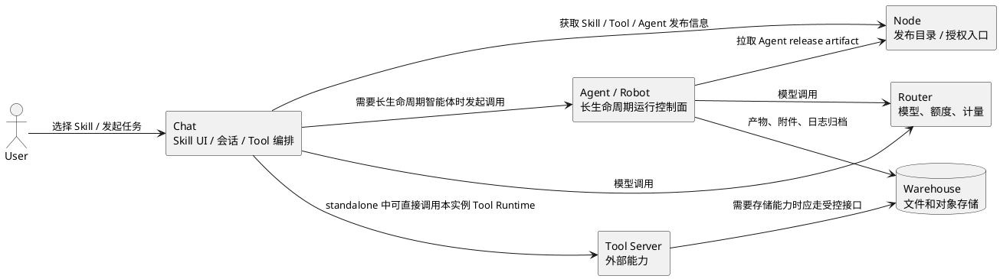

# Chat Skill 与 Tool 运行机制

本文说明 Chat 当前如何支持 Skill 和 Tool，重点解释 Tool 怎么安装、保存配置、启动并在对话中起作用。

相关背景：

- [技能规范](./技能规范.md)
- [ENABLE_TOOLS 工作机制与后续演进](./工具启用机制与演进.md)
- [网页版与桌面版产品定位](./网页版与桌面版产品定位.md)

## 1. 核心结论

Chat 支持 Skill，也支持 Tool，但两者不是同一个层次：

| 概念 | 当前含义 | 是否等于安装服务 |
| --- | --- | --- |
| Skill | 用户选择的任务入口和会话配置，包含说明、模型、工具依赖和界面配置 | 否 |
| Tool | 模型可调用的外部能力，例如搜索、网页抓取、文件、Git | 否 |
| Tool Server | 承载 Tool 的运行进程或服务，当前主要通过 MCP 协议连接 | 是运行能力 |
| Tool Runtime | Chat 用来启动、连接、列出和调用 Tool Server 的服务端运行层 | 是运行环境 |

当前实现里：

- Skill 定义、安装和会话启动在 Web / standalone / Tauri desktop 都可用。
- Tool Runtime 只在 `standalone` 或 `npm run dev` 这种有 Next Node 进程的模式下可用。
- Tauri desktop 当前走静态导出，工具运行时被显式禁用，不读取 `data/tool_config.json`，也不会启动本机 MCP/stdio 工具进程。
- Skill 可以声明需要哪些 Tool Server；只有当前运行环境真的启用了这些 Tool Server，技能才会进入可用状态。

## 2. 大图



这张图里最重要的边界是：Skill 存在于用户账户和会话层；Tool Server 存在于运行环境层。启用 Skill 不会自动部署 Tool Server。

## 3. Skill 是怎么工作的

Skill 是 Chat 的任务入口。它通常包含：

- 名称、描述、分类和开场问题。
- Instructions，也就是给模型的任务说明。
- 默认模型、候选模型和参数。
- 会话工具条配置，例如是否显示模型选择、工具按钮、实时语音等。
- 工具依赖声明，例如 `tools.toolServers = ["fetch", "git"]`。
- 启动目标，例如普通 Chat 会话或图片创作工作区。

当前代码里，Skill 保存在 `skill-store`。新建会话时，Chat 会把 Skill 快照保存到会话里。这意味着历史会话使用创建时的 Skill 配置，不会因为市场里的 Skill 更新而自动改变。

Skill 的安装更准确地说是“添加到当前账户”：



这里不会发生：

- 不会启动新的后端服务。
- 不会给服务器安装命令行程序。
- 不会让普通对话自动获得全部工具能力。

## 4. Tool 是怎么安装的

当前 Tool 的“安装”分为两个动作：发现工具包定义，写入当前运行实例的工具配置。

工具包定义来自内置 preset 或 marketplace 源，里面描述：

- `id`：工具服务器 ID，例如 `fetch`、`filesystem`、`git`。
- `command`：启动命令，例如 `npx`、`uvx`、`mcp-server-fetch`。
- `baseArgs`：基础参数。
- `configSchema`：需要用户填写的配置，例如 API Key、允许访问的目录、仓库路径。
- `argsMapping`：把用户配置映射到启动参数或环境变量。

用户在发现页启用 Tool 时，Chat 会生成一条 `ServerConfig`：

```json
{
  "command": "npx",
  "args": ["-y", "@modelcontextprotocol/server-filesystem", "/allowed/path"],
  "env": {},
  "status": "active"
}
```

然后写入：

```text
data/tool_config.json
```

或写入 `TOOL_CONFIG_PATH` 指定的文件。

安装流程如下：



因此，Tool 安装不是安装到用户账户，而是安装到当前 Chat 运行实例。

这点对 Web 和 desktop 的判断很关键：

| 场景 | Tool 配置属于谁 | Tool 实际跑在哪里 |
| --- | --- | --- |
| `npm run dev` | 当前本地开发实例 | 开发机上的 Next Node 进程启动外部命令 |
| standalone 单用户自托管 | 当前部署实例 | 部署服务器或本机服务进程 |
| 多人访问的 Web 服务 | 当前服务端实例 | Web 服务端，不是访问者电脑 |
| Tauri desktop 当前版本 | 不使用 standalone 工具配置 | 不启动本地 Tool Runtime |

## 5. Tool 是怎么起作用的

Tool 只有在三个条件同时满足时才会进入对话：

1. 服务端启用了 Tool Runtime：`ENABLE_TOOLS=1` 或 `ENABLE_TOOLS=true`。
2. 当前 Skill 声明了需要的 Tool Server。
3. `tool_config.json` 里对应 Tool Server 已配置并处于可用状态。

对话运行时流程如下：



当前实现使用文本协议桥接工具调用：模型需要输出类似下面的代码块，Chat 才会识别并执行：

````markdown
```json:mcp:fetch
{
  "jsonrpc": "2.0",
  "method": "tools/call",
  "params": {
    "name": "fetch",
    "arguments": {
      "url": "https://example.com"
    }
  }
}
```
````

工具返回后，Chat 会把结果包装成：

````markdown
```json:mcp-response:fetch
{ "...": "..." }
```
````

然后作为下一轮上下文继续发给模型。

## 6. Skill 和 Tool 的组合关系

Skill 声明 Tool 依赖，但不拥有 Tool 运行状态。



一个 Skill 可能出现三种状态：

| 状态 | 含义 | 用户应该看到 |
| --- | --- | --- |
| 可用 | 模型、工具、存储等依赖都满足 | 可以直接使用 |
| 需要配置 | 缺少 API Key、目录、模型选择等用户或实例配置 | 进入配置页 |
| 不可用 | 当前环境不支持，例如 desktop 尚无本地 Tool Runtime | 明确不可用原因 |

## 7. standalone 和 desktop 的差异

### 7.1 standalone

standalone 可以支持 Tool Runtime，因为它有 Next Node 进程：

- `app/tools/actions.ts` 是 Server Action，运行在服务端。
- `initializeToolSystem()` 会读取工具配置。
- `createClient()` 会通过 `StdioClientTransport` 启动外部命令。
- `getAllTools()` 会列出当前已连接 Tool Server 的工具。
- `executeToolAction()` 会把 MCP JSON-RPC 请求发给对应 client。

启用要求：

```bash
ENABLE_TOOLS=1
```

可选指定工具配置路径：

```bash
TOOL_CONFIG_PATH=/path/to/tool_config.json
```

### 7.2 Tauri desktop

当前 desktop 不支持本地 Tool Runtime：

- Tauri 构建使用静态导出。
- 构建时使用 `app/tools/actions.export.ts`。
- `isToolRuntimeEnabled()` 固定返回 `false`。
- `getAllTools()` 返回空列表。
- `addToolServer()`、`executeToolAction()` 等会抛出不可用错误。

所以 desktop 当前可以使用：

- 不依赖外部 Tool Server 的 Skill。
- 只依赖 Router 模型能力的 Skill。
- 图片创作、实时聊天等由现有前端和 Router 支撑的工作区。

desktop 当前不能直接使用：

- 需要本机启动 MCP stdio 进程的 Tool。
- 需要读写用户本机目录的 filesystem Tool。
- 需要操作用户本机 Git 仓库的 git Tool。

后续如果要支持 desktop 本地 Tool Runtime，不能简单复用 standalone 的 `data/tool_config.json`。需要单独设计：

- Tauri 用户数据目录中的配置保存。
- API Key 和本地路径的安全存储。
- 命令白名单。
- 文件目录授权。
- 首次运行和高风险操作的用户确认。
- 工具进程状态、日志和错误诊断。
- 多平台差异。

## 8. 和 Node、Agent、Warehouse、Router 的关系



边界可以简化成一句话：

> Chat 负责让用户选择 Skill，并在会话里编排模型和工具；Node 负责发布目录；Router 负责模型；Warehouse 负责文件对象；Agent/Robot 负责长期运行的智能体生命周期。

## 9. 排查路径

Tool 没有起作用时，按顺序检查：

1. 当前是否是 standalone 或 `npm run dev`，不是 Tauri 静态导出。
2. 服务进程是否设置了 `ENABLE_TOOLS=1` 或 `ENABLE_TOOLS=true`。
3. `data/tool_config.json` 或 `TOOL_CONFIG_PATH` 是否存在且可读写。
4. 工具条目是否包含正确的 `command`、`args`、`env`。
5. 服务进程是否有权限启动该命令，例如 `npx`、`uvx`、`mcp-server-fetch`。
6. 工具状态是否为 `active`，不是 `paused`、`error` 或 `undefined`。
7. 当前会话绑定的 Skill 是否声明了对应 `tools.toolServers`。
8. 通用问答或普通会话不会自动注入 Tool。
9. 模型输出的 `json:mcp:<clientId>` 是否匹配 Skill 允许的 Tool Server ID。
10. 如果是 desktop，当前版本预期就是不执行本地 Tool Runtime。

## 10. 当前实现限制

- Tool Runtime 是实例级能力，不是账户级能力。
- 多人 Web 部署中，不能让普通用户通过页面配置任意服务端命令。
- 当前主要支持 stdio Tool Server；远程 HTTP/SSE Tool Server 需要继续产品化和安全设计。
- 工具调用目前通过 `json:mcp` 文本块桥接，不等同于模型厂商原生 tool calling 的完整能力。
- desktop 本地 Tool Runtime 需要单独方案，不应直接迁移 standalone 的配置文件和权限模型。
